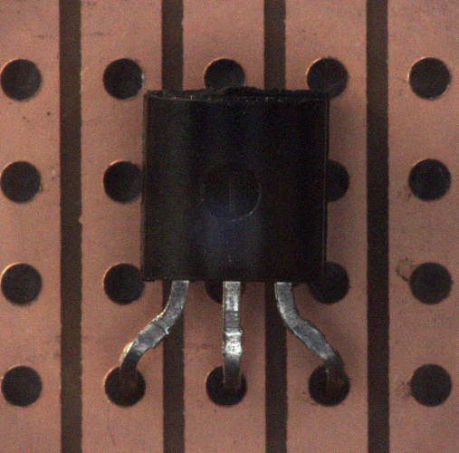
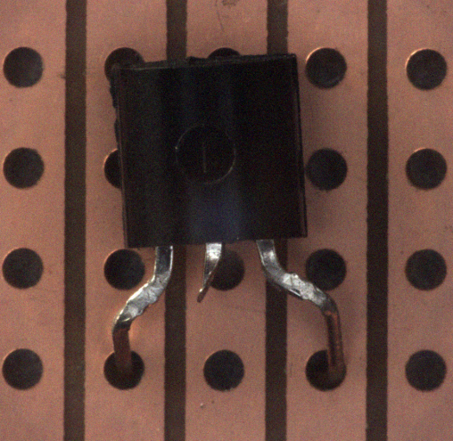

# 주제
##### 반도체 소자 이상 탐지 AI 모델 개발
##### 생산 공정에서 촬영된 반도체 소자 이미지로부터 비정상 샘플을 검출하는 비지도 학습 기반의 이상 탐지 AI 모델 개발
 

# train.csv
##### 학습용 정상 반도체 소자 이미지 샘플 213개

 

# submission.csv
##### test용 sample 총 100개 (anomaly, 정상 데이터 모두 포함)

##### 이상 반도체 소자 예시

 

정상 데이터 만을 이용하여 비정상 데이터를 찾아 내는것이므로 anomaly detection을 이용해야함
## 1. 예측 모델
##### 1-1) pretrained resnet50 feature extractor + autoencoder 이용하였으나 좋지 않은 성능

##### 1-2) Patchcore model(최종)
##### -anomalib를 이용하여 patchcore 이용하였음
##### -trainset에서 최대 threshold를 활용하는 등 적정 threshold를 찾아줌